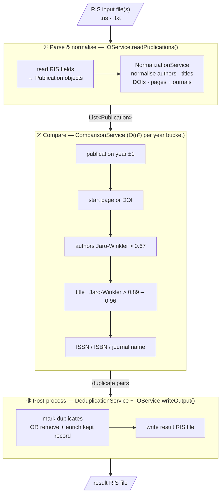
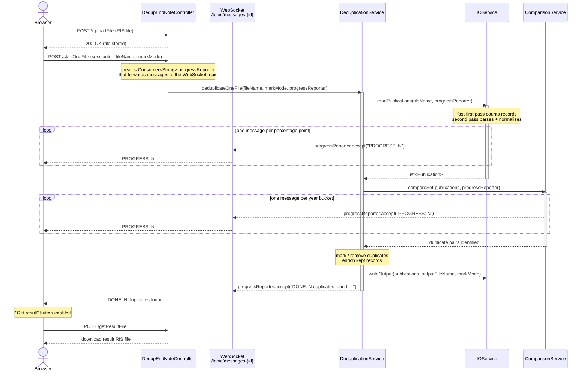

# DedupEndNote — Architecture

## Data pipeline

The diagram below shows how a RIS file is transformed into a deduplicated result.
In **two-file mode** the parse step runs twice — once for the OLD file and once for the NEW file — before the combined set enters the comparison step.

All five comparison steps must pass for a pair to be considered duplicate.
The comparison short-circuits on the first mismatch, so cheap checks (year, page/DOI) run before expensive ones (Jaro-Winkler similarity).

---

## Runtime interaction — single-file deduplication

The diagram below shows the full request/response cycle, including how progress
is pushed to the browser over a WebSocket while the deduplication runs in a
virtual thread.
In **two-file mode** the flow is identical except that `readPublications()` is
called twice (OLD file, then NEW file) before `compareSet()`.

